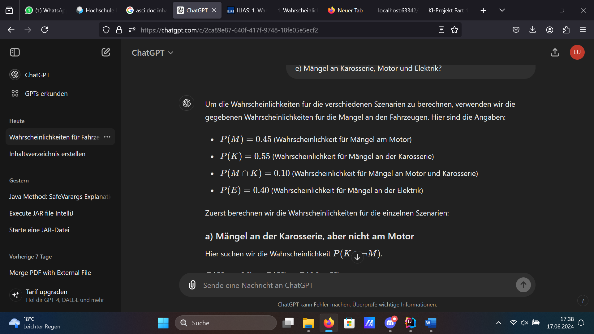
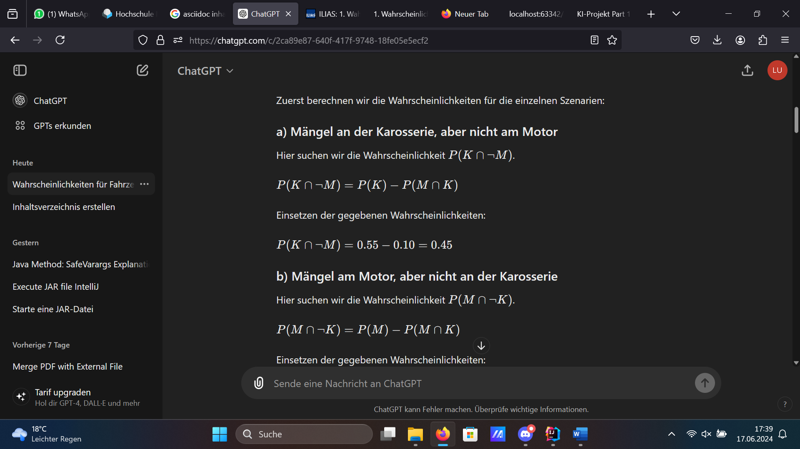
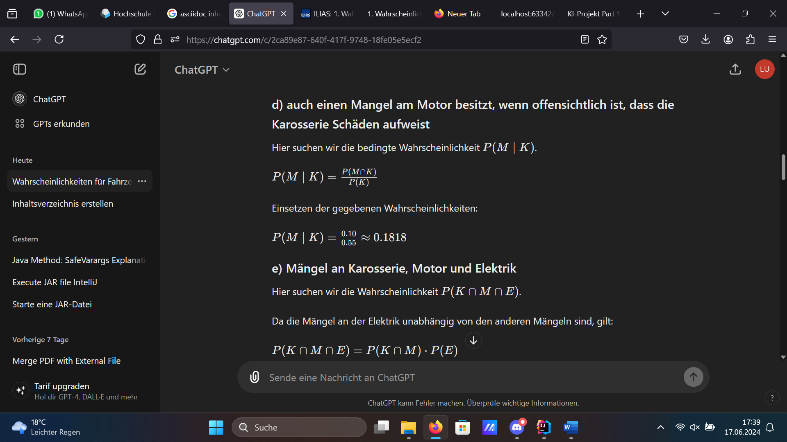
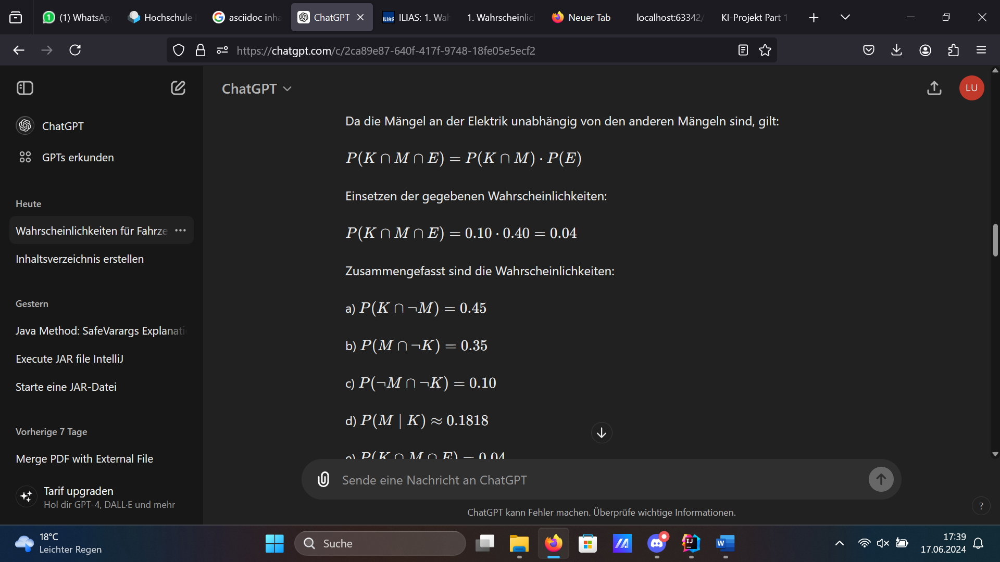
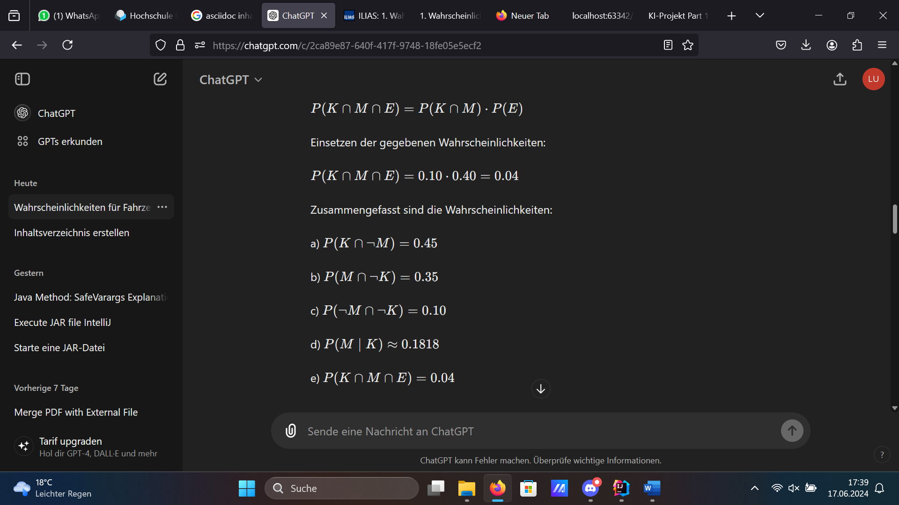
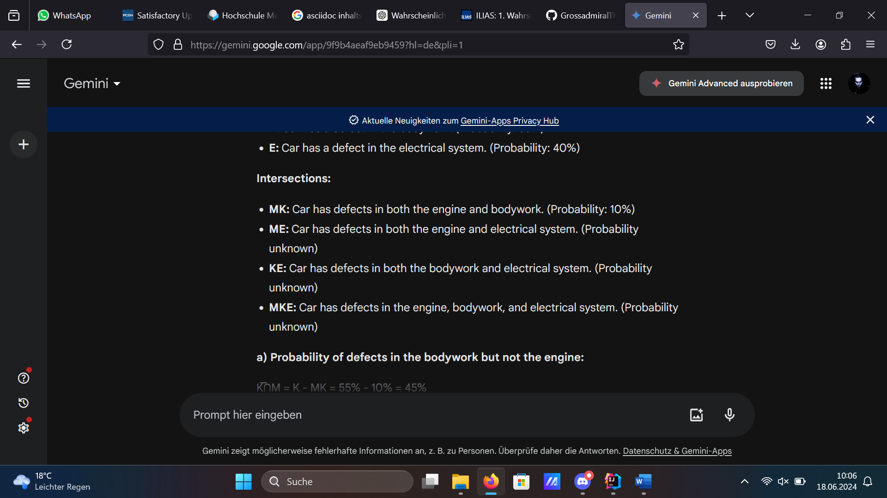
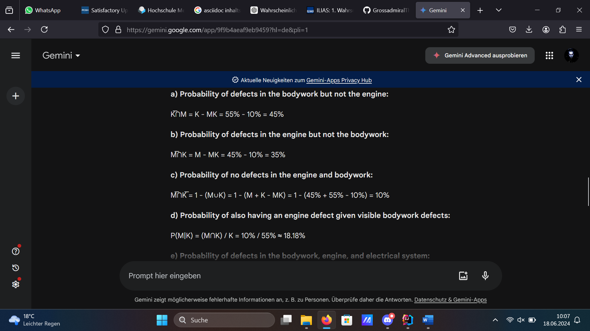
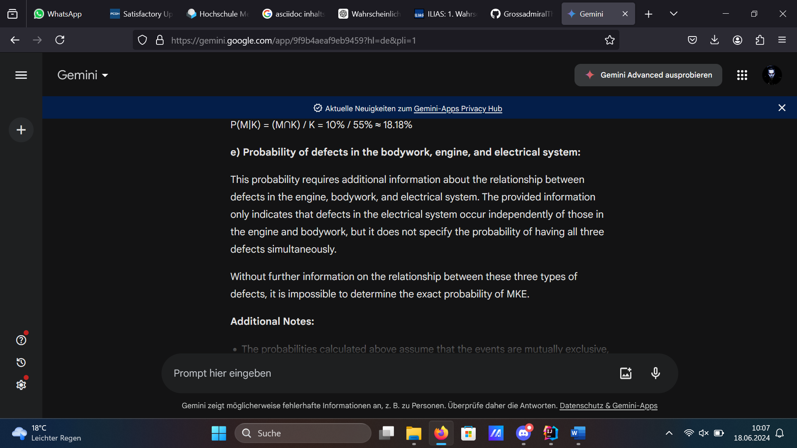
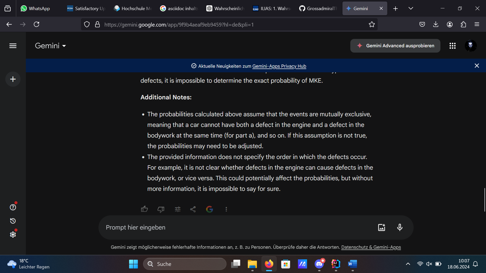

= KI-Projekt Part 1 - Spezialisierung Mathematik
:project_name: KI-Projekt
:toc: left
:toc-title: Inhaltsverzeichnis
:numbered:

'''

== Vorbereitungen
=== Bewertungsschema
    1. Datum
    2. Aufgabenstellung
    3. Richtige Antwort
    4. Antwort von ChatGPT
    5. Zusammenfassung der Aufgabe
    6. Daten und Ergebnisse von möglichen Wiederholungen

'''

=== Verwendete Chatbots
    1. ChatGPT
    2. Gemini

== Ilias-Aufgabentests
=== Test 1
==== Datum
- 17.6.2024 und 18.6.2024

'''

==== Aufgabenstellung
    Aus Erfahrung ist bekannt, dass bei Fahrzeugen, die der Autohändler "Marschda" in Zahlung nimmt, zu 45 % Mängel am Motor, zu 55% an der Karosserie und zu 10 % an Motor und Karosserie auftreten. Mit Wahrscheinlichkeit 40% weisen die Fahrzeuge Mängel an der Elektrik auf. Diese Mängel treten unabhängig von denen an Motor und Karosserie auf. Wie groß ist die Wahrscheinlichkeit dafür, dass ein in Zahlung genommener Wagen
    a) Mängel an der Karosserie, aber nicht am Motor aufweist,
    b) Mängel am Motor, aber nicht an der Karosserie besitzt,
    c) ohne Mängel an Motor und Karosserie ist,
    d) auch einen Mangel am Motor besitzt, wenn offensichtlich ist, dass die Karosserie Schäden aufweist,
    e) Mängel an Karosserie, Motor und Elektrik?

'''

==== Lösung
      1a) 0,45
      1b) 0,35
      1c) 0,1
      1d) 0,182
      1e) 0,04

'''

==== Antwort der Chatbots

===== ChatGPT

image::Screenshot (4).png[Dritter Teil der Antwort, alt="Der Tragödie dritter Teil", align=center]

'''

===== Gemini
image::Screenshot (8).png[Teil 1 der Antwort Geminis, alt="Beginn der Antwort Geminis",align=center"]

