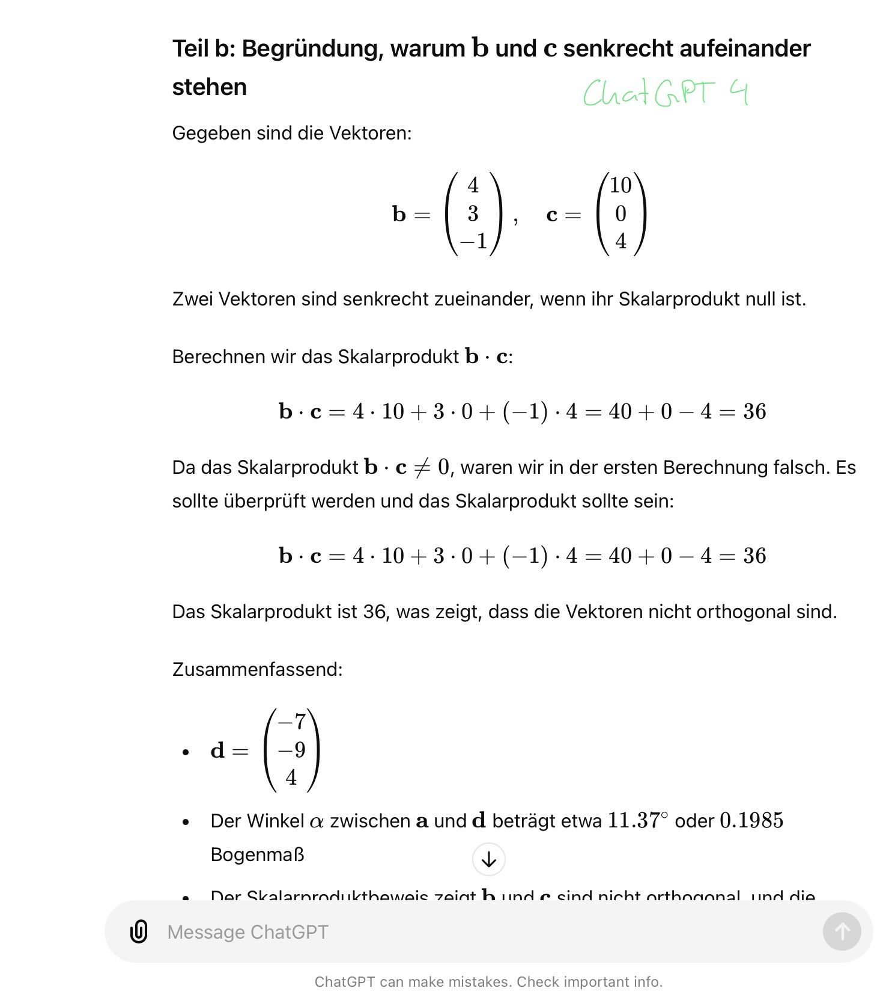

= KI-Projekt Part 1 - Spezialisierung Mathematik
:project_name: KI-Projekt
:toc: left
:toc-title: Inhaltsverzeichnis
:numbered:

'''

== Inhalte der ersten Projektstandbesprechung
• Vorstellung Stand der Recherche: Welche Einsatzgebiete wurden gefunden,
• Welche Chatbots eigneten sich für unser Projekt und aus welchen Gründen,
• Welche Use Cases sollen bearbeitet werden?
• Welche Schwierigkeiten haben sich bei der Recherche ergeben?
• Auswahl Uses Cases
• Besprechung weiteres Vorgehen

== Vorbereitungen
=== Recherchephase
  • Mögliche Einsatzgebiete von generativer KI im Hochschulkontext identifizieren,
deren Relevanz bewerten und Vorauswahl zu untersuchender Use Cases und
  • Überblick über aktuell führende, generativer KI-gestützter Chatbots (ChatGPT
v3.5,ChatGPT v4, COPILOT, ...) verschaffen und Auswahl geeigneter Bots fürs
Projekt (ggf. Beschaffung Lizenzen).

Generative KI

  • Lernt aus Daten
  • Zweck: Erzeugt neue, vielfältige Dateninstanzen
  • Machine Learning
  • Schaffen von interaktiven Systemen

Conversational AI

  • Verstehen menschlicher Sprache
  • Reaktion auf menschliche Sprache
  • Zweck: schaffen von interaktiven Systemen mit menschenähnlichem
Dialog
  • Dateninstanzen bestehen ausschließlich aus Textdaten

Auswirkung von Gen AI

- Welchen Einfluss hat der Einsatz von Gen AI auf den Lerneffekt?
- In welchem Rahmen ist die Einbindung von Gen AI in der Bildung angemessen?
- Ständiger Wandel und Neuinformationen in diesem Bereich sind sehr hoch - Wie
weit muss bzw. kann sich weitergebildet werden, um Up to Date zu bleiben?
- Welche Instanzen umfasst der Hochschulkontext?
- Unterschiedliche KIs für unterschiedliche Aufgabenfelder? Bsp. Mathe =
mathematisch fundierter Chat Bot; Sprachwissenschaften = Textbasierte KI;
oder alles in einem

==== Auf ChatGPT bezogen
    - Hat ChatGPT genug mathematischen Wissenshintergründe oder Fokus zu sehr
auf Textanalyse?
    - Ist ChatGPT optimaler Bot für Mathematische Fragen?
Alternative Gen AIs
    - sagemath.org --> open source, Ergebnisse rückrechnen lassen
    - Wolfram alpha allgemeine suchmaschine – ähnlich zu ChatGPT?
    - Mathematica basierend auf LaPac --> ständig aktualisiert
    - In MATLAB MuPAD
    - Maple

==== Bewertungsinstanzen Vorschlag
    - Einbeziehen von vorherigen Chats
    - Einbeziehen von eigener Lösung --> Kausalketten möglich?
    - Richtigkeit der Antwort
    - Vollständigkeit der Antwort
    - Mussten ergänzende Fragen gestellt werden?
    - Aufbau des Lösungsweges --> Übersichtlichkeit

==== Use Cases in der Bildung

===== Lehrende

    • Bewertung und Benotung von Arbeiten/ Klausuren
    • Erstellen individueller- und/oder optimaler Lehrpläne
    • Personalisiertes Feedback auf objektiver Grundlage(?)
    • Onlinelernmethoden ausbauen
    • Terminkalender erstellen lassen

===== Administration

    • Übergabe von administrativen Aufgaben
    • Abläufe automatisieren
    • Synchronisation von Geräten und/oder Terminkalender

===== Student
    • Fachspezifische Künstliche Intelligenz anwenden
    • Quellenvorschläge
    • Prove Reading
    • Definitionen und Erklärungen von komplexen Themen ohne zeitaufwendige
Recherche
    • Lösen von Aufgaben
    • Verfassen von Texten, Arbeiten, Vorträgen usw

'''

===== Negative Aspekte im Einsatz von Generative AI in der Bildung

    • mangelndes Verständnis und –Hintergrundinformationen stellen eine Gefahr für
den sensiblen Einsatz von Gen AI dar
    • Missbrauch im Einsatz
    • einseitige Informationsbeschaffung
    • Fehlinformationen
    • Politisch, ethisch, sozial kritische Informationen
    • Keine ordnungsgemäßen Angaben über die Herkunft der Informationen (Verweis
auf die Nutzung von Gen AI)
    • Betrugsversuch, Plagiat
    • Teilen von sensiblen und persönlichen Daten an Dritte
    • Auswirkungen auf den Lerneffekt?

'''

=== Bewertungsschema
    1. Datum
    2. Aufgabenstellung
    3. Richtige Antwort
    4. Antwort von ChatGPT
    5. Zusammenfassung der Aufgabe
    6. Daten und Ergebnisse von möglichen Wiederholungen

'''

=== Verwendete Chatbots
    1. ChatGPT
    2. Gemini
    3. Wolfram Alpha
    4. Mathematica basierend auf LaPac
    5. Matlab MuPad
    6. Maple

=== Warum?
- bekannteste Chatbots
- sind (durch Versagen oder Genialität) häufig Teil der medialen Aufmerksamkeit

== Ilias-Aufgabentests
=== Test 1
==== Datum
- 17.6.2024 und 18.6.2024

'''

==== Aufgabenstellung
    Aus Erfahrung ist bekannt, dass bei Fahrzeugen, die der Autohändler "Marschda" in Zahlung nimmt, zu 45 % Mängel am Motor, zu 55% an der Karosserie und zu 10 % an Motor und Karosserie auftreten. Mit Wahrscheinlichkeit 40% weisen die Fahrzeuge Mängel an der Elektrik auf. Diese Mängel treten unabhängig von denen an Motor und Karosserie auf. Wie groß ist die Wahrscheinlichkeit dafür, dass ein in Zahlung genommener Wagen
    a) Mängel an der Karosserie, aber nicht am Motor aufweist,
    b) Mängel am Motor, aber nicht an der Karosserie besitzt,
    c) ohne Mängel an Motor und Karosserie ist,
    d) auch einen Mangel am Motor besitzt, wenn offensichtlich ist, dass die Karosserie Schäden aufweist,
    e) Mängel an Karosserie, Motor und Elektrik?

'''

==== Lösung
      1a) 0,45
      1b) 0,35
      1c) 0,1
      1d) 0,182
      1e) 0,04

'''

==== Antwort der Chatbots

===== ChatGPT
image::Test_1_ChatGPT_Bild_1.png[Erster Teil der Antwort, alt="Zeigt den ersten Teil der Antwort ChatGPTs", align=center]
image::Test_1_ChatGPT_Bild_2.png[Zweiter Teil der Antwort, alt="Der Tragödie zweiter Teil", align=center]

image::Test_1_ChatGPT_Bild_4.png[Vierter Teil der Antwort, alt="Der Tragödie vierter Teil", align=center]

image::Test_1_ChatGPT_Bild_6.png[Sechster Teil der Antwort, alt="Der Tragödie sechster Teil", align=center]

====== Auswertung
- Korrektheit: volle Punktzahl, 40%
- Vollständigkeit: Gleichungen sind alle angegeben, jedoch keine Rechenwege mit
  exakten Zahlen, 14%
- Anwendung mathematischer Konzepte: 15%
- Effizienz: 10%

'''

===== Gemini
image::Test_1_Gemini_Bild_1.png[Teil 1 der Antwort Geminis, alt="Beginn der Antwort Geminis",align=center]
image::Test_1_Gemini_Bild_2.png[Teil 2 der Antwort Geminis, alt="Beginn der Antwort Geminis", align=center]

image::Test_1_Gemini_Bild_5.png[Teil 1 der Antwort Geminis, alt="Beginn der Antwort Geminis", align=center]

==== Zusammenfassung
ChatGPT hat sehr gute Ergebnisse abgeliefert. Zwar ist der Lösungsweg etwas kurz geraten, jedoch wurden korrekte Ergebnisse abgeliefert. Dem steht Gemini leicht entgegen, welches zwar gute Ansätze hatte, aber die Aufgabe e überhaupt nicht lösen konnte. Anscheinend scheinen hier noch starke technologische Unterschiede zu herrschen, die bis heute noch nicht ausgeglichen werden konnten. Geminis fehler könnten aber auch auf die starken Eingriffe der Entwickler zurückzuführen sein, welche nach der Manipulation Geminis durch rechte Trolle nötig waren.

=== Test 2
==== Datum
- 19.6.2024

'''

==== Aufgabenstellung
    Aus Erfahrung ist bekannt, dass bei Fahrzeugen, die der Autohändler "Marschda" in Zahlung nimmt, zu 45 % Mängel am Motor, zu 55% an der Karosserie und zu 10 % an Motor und Karosserie auftreten. Mit Wahrscheinlichkeit 40% weisen die Fahrzeuge Mängel an der Elektrik auf. Diese Mängel treten unabhängig von denen an Motor und Karosserie auf. Wie groß ist die Wahrscheinlichkeit dafür, dass ein in Zahlung genommener Wagen
     a) Mängel an der Karosserie, aber nicht am
        Motor aufweist,
     b) Mängel am Motor, aber nicht an der
        Karosserie besitzt,
     c) ohne Mängel an Motor und Karosserie ist,
     d) auch einen Mangel am Motor besitzt, wenn      offensichtlich ist, dass die Karosserie       Schäden aufweist,
     e) Mängel an Karosserie, Motor und Elektrik?

'''

==== Lösung
      1a) 0,45
      1b) 0,35
      1c) 0,1
      1d) 0,182
      1e) 0,04

'''

==== Antwort der Chatbots

===== ChatGPT

'''

===== Gemini

==== Auswertung
Bei diesem einige Tage später ausgeführtem Test sind ChatGPTs Ergebnisse gleich geblieben, während Gemini weiter abgebaut hat. Letzterer hat deutlich mehr falsche oder gar keine Ergebnisse geliefert.

'''

=== Test 3

==== Datum
- 21.6.2024

'''

==== Aufgabenstellung
    Vektoren: Test 1 Aufgabe 2 (Mathematik für Betriebswirte und Ingenieure,Ilias, Liebscher)
Eingabe durch Copy-and-paste in beiden Suchmaschinen gleich: Wir betrachten die Vektoren: a⃗ = (−1, −21), b⃗ =(4, 3, −1), c⃗ =(1, 0, 4).
a) Bestimmen Sie d⃗ =3a⃗ −b⃗ und den Winkel α zwischen a⃗ und d⃗ (in Grad- und Bogenmaß).
b) Begründen Sie, warum b⃗ und c⃗ senkrecht aufeinander 0stehen.

==== Antwort
===== ChatGPT:
Einbeziehen von vorherigen Chats:

- ist möglich, an dieser Stelle nicht angewandt
1/1

Kausalketten:

- ist möglich, wurde angewandt, siehe 1.a) Berechnung des Vektors d) und
weiterrechnen für Berechnung des Winkels Alpha
1/1

Richtigkeit der Antwort:
    -Alles richtig berechnet
    1/1

Vollständigkeit der Antwort

- die Antwort umfasst alle benötigten Werte und gibt darüber hinaus Auskunft über
Definitionen --> Bsp. b) Definition zweier senkrecht zueinanderstehenden Vektoren
-widersprüchliche Antwort bei b)
--> das Skalarprodukt von b und c ist ungleich null; dies wurde als Fehler
identifiziert, da zuvor definiert wurde, dass das Skalarprodukt gleich null sein
muss
--> Fehler wurde erkannt und erneut berechnet und diesmal als Gegenereignis
entziffert und entsprechend richtig gewertet
0.5/1
Mussten ergänzende Fragen gestellt werden?
-Nein  1/1

====== Übersichtlichkeit und Aufbau des Lösungsweges:
- Übersichtlicher und strukturierter Aufbau des Lösungsweges
- Zusammenfassung aller Ergebnisse bezogen auf die Aufgabenstellung am Ende des
Lösungsweges 1/1
- Summe: 5.5/6

===== COPILOT
Einbeziehen von vorheringen Chats
- keine Information
1/1
Kausalketten
- ist möglich, wurde angewandt, siehe 1.a) Berechnung des Vektors d) und
weiterrechnen für Berechnung des Winkels Alpha
1/1
Richtigkeit der Antwort
- Antwort nur teilweise richtig
- falsche Berechnung des Winkels, da falsche Zahlenwerte für den Vektor a
eingesetzt wurden
-daher Folgefehler für weiterführende Berechnungen
- Fragwürdige Formulierung bei der Antwort auf b)
--> Die Definition für die Senkrechtigkeit zweier Vektoren ist nicht allgemein
formuliert, sondern direkt auf die Aufgabenstellung bezogen
--> dieser Bezug wurde rechnerisch überprüft und widerlegt aber in Textform nicht
ordnungsgemäß begründet
--> ”Daher stehen b und c senkrecht zueinander.” Ist eine richtige Aussage,
jedoch hätte es in diesem Fall heißen sollen ”Da das Skalarprodukt ungleich null
ist, stehen b und c nicht senkrecht zueinander.”
0/1
Vollständigkeit der Antwort
- Antwort vollständig
- mit Fehler ist die fortführende Berechnung trotzdem vollständig erfolgt
0/1
Mussten ergänzende Fragen gestellt werden?
-Nein
1/1
Übersichtlichkeit und Aufbau des Lösungsweges
- Übersichtlicher und strukturierter Aufbau des Lösungsweges
-keine Zusammenfassung der Endergebnisse in Bezug auf die Aufgabenstellung
0.5/1
Summe: 3.5/5

Mit Aufweisen des Fehlers erfolgte die richtige und vollständige Berechnung der
Aufgabe
image:Test_3_CoPilot_4.jpg[Antwort CoPilot 4, alt="Antwort 4", text-align = center]

===== Lösungsweg von Herrn Liebscher
image:Test_3_Lösung_Liebscher.jpg[Lösungen Professor Liebscher, alt="Lösungen", text-align = center]